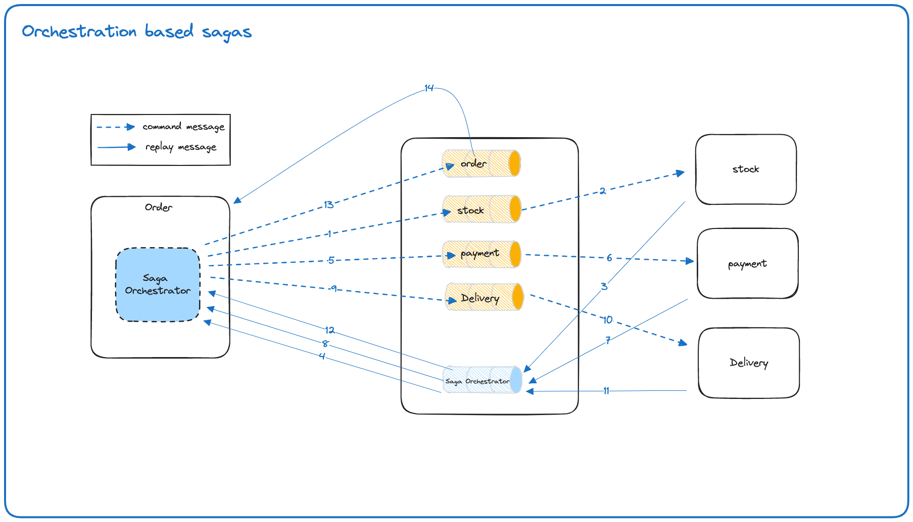

## Django saga orchestrator example

This repository aims to implement orchestration-based sagas

### Getting Started

To get started, simply clone this repository and execute the `./start.sh` script. This will set up the necessary environment and dependencies for running the microservices.

### Web App

Upon successful setup, you can navigate to the provided web page to interact with the application.

### Architecture

Here's an overview of the architecture used for orchestrating sagas within the microservices:

### Saga Orchestration Pattern

The **Saga Pattern** is a method for managing distributed transactions within microservices architecture. It helps maintain data consistency across multiple services by breaking a single transaction into a series of smaller, independent steps or sub-transactions called sagas. These sagas are orchestrated in a coordinated manner to ensure the overall transactional integrity.

For further reading on the Saga Pattern, refer to [The Saga Pattern](https://medium.com/cloud-native-daily/microservices-patterns-part-04-saga-pattern-a7f85d8d4aa3).
